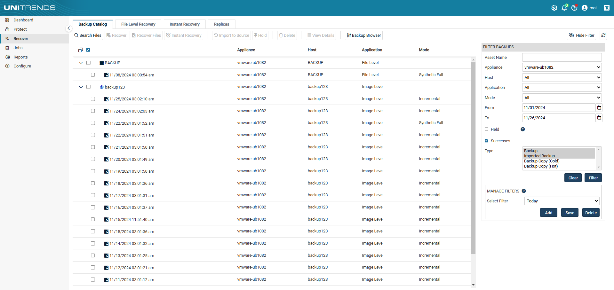

# 즉각 복구(Instant Recovery)

즉각 복구(Instant Recovery)는 IR이라고도 하며, <b>Windows 이미지 백업</b>과 <b>호스트 백업</b>을 지원합니다. 

## 1. IR 모드

즉각 복구는 두 가지 모드 중 하나를 선택하여 수행할 수 있습니다.:
> * <b>검증(Audit) Mode</b>
>   *  Windows 시스템이 정상적으로 복구될 수 있는지 확인하기 위해 사용됩니다.
>   * 네트워크 연결이 없는 상태로 동작하며, 생성된 VM은 운영 환경용이 아닙니다.
>   *  원본 시스템에 영향을 주지 않고 데이터를 검증한 후 IR 세션을 종료하여 리소스를 해제합니다.

> * <b>즉각 복구(Instant Recovery) 모드</b>
>   * 장애가 발생하거나 손상된 Windows 시스템을 대체하기 위해 사용됩니다.
>   * 선택한 백업 데이터를 사용해 어플라이언스 또는 대상 호스트에서 VM을 생성하고, 즉시 운영 환경에서 사용할 수 있습니다.
>   * 가상 호스트(ESXi 또는 Hyper-V)의 경우, 데이터 마이그레이션 후 IR 세션을 종료하면 VM은 호스트에 남아 계속 작동합니다.

## 2. IR 스토리지 할당
* 즉각 복구(IR) 수행 전에 즉각 복구 용도로 미리 충분한 스토리지를 할당해야 합니다.
* Unitrends는 초기 배포 직후, 대상 시스템 장애가 발생하기 전에 즉각 복구를 위한 공간을 확보할 것을 강력히 권장합니다.
* 나중에 공간을 할당할 수도 있지만, 이 경우 어플라이언스가 백업본을 제거하여 공간을 확보해야 할 수 있습니다.

> 스토리지 할당이 필요한 이유
> * IR 복구된 시스템의 디스크는 스토리지 마이그레이션이 완료될 때까지 Unitrends 어플라이언스에 존재합니다.
> * IR 복구할 시스템 원본 크기의 최소 <b>20%</b>를 즉각 복구 스토리지로 할당하십시오.
> * 장기적인 복구 작업에서는 데이터 증가를 대비하여 추가 공간을 확보해야 합니다.
> * 즉각 복구를 위해 할당된 스토리지는 Windows 복제(Replica) 기능에서도 사용할 수 있습니다.

## 3. 타겟 대상별 요구사항

IR은 선택한 백업본을 기반으로 VM을 생성합니다. 
IR VM은 ESXi 서버 또는 Hyper-V 서버에 상주할 수 있습니다.  
<b>① VMware ESXi 호스트</b>
* vCenter 버전 및 라이선스
    * Storage vMotion을 지원하는 라이선스가 있어야 합니다.
    * IR을 수행하는 Unitrends 어플라이언스의 대상으로 등록되어야 합니다.
> ※ 참고사항:
> * 단일 ESXi 서버를 사용하면 검증(Audit) 모드는 수행할 수 있지만 즉각 복구(Instant Recovery) 모드는 지원되지 않습니다.

* ESXi 서버
    * ESXi 버전 5이상을 실행해야 합니다.
    * IR을 수행하는 Unitrends 어플라이언스의 대상으로 등록되어야 합니다.
    * Windows 이미지 백업에 대한 즉각 복구의 경우, 복구하는 Windows 대상의 운영체제를 지원해야 합니다. 
    * IR VM에 대한 충분한 저장소와 리소스가 있어야 합니다.

* IR VM 리소스
IR VM은 원본 대상을 기준으로 리소스가 할당됩니다. 
     * 원본 대상에 6개 이상의 CPU가 있는 경우, IR VM에 4개의 CPU가 할당됩니다.
     * 원본 대상에 2개 이상의 CPU가 있는 경우, IR VM에 2개의 CPU가 할당됩니다.
     * 원본 대상에 2개 미만의 CPU가 있는 경우, IR VM에 1개의 CPU가 할당됩니다.
     
     * 원본 대상에 8GB 이상의 RAM이 있는 경우 IR VM에 8GB가 할당됩니다.
     * 원본 대상에 4GB 이상의 RAM이 있는 경우 IR VM에 4GB가 할당됩니다.
     * 원본 대상에 2GB 이상의 RAM이 있는 경우 IR VM에 2GB가 할당됩니다.
     * 원본 대상에 2GB 미만의 RAM이 있는 경우 IR VM에 1GB가 할당됩니다.

* IR VM 변경성
* 검증(Audit) 모드에서: 
    * IR VM은 네트워크 연결이 없습니다.
    * 검증(Audit) 모드에서 변경한 내용은 Unitrends 백업에 적용되지 않으며, IR 세션을 종료하면 손실됩니다.
* 즉각 복구(Instant Recovery) 모드에서: 
    * IR VM의 변경사항은 Unitrends 어플라이언스에서 수행되는 원본 대상 백업에 의해 적용되며, IR 세션을 종료한 후에도 유지됩니다.

## 4. 즉각 복구 수행(Windows 이미지 백업)
> <b>※ 중요:</b> 
> * 수행 전, 미리 IR 스토리지를 적절하게 할당해놔야 합니다.

### 4-1. IR - 검증(Audit)모드 수행 단계
검증 모드에서 즉각 복구를 수행하여 백업본을 사용하여 Windows 대상 시스템을 복구할 수 있는지 확인합니다. 
필요에 따라 이 절차를 반복하여 새 백업본을 테스트합니다. 

(1) <b>복구 시점 선택:</b> 
<b>Recover → Backup Catalog</b>탭에서 복구에 사용할 시점을 선택합니다.

* Backup Catalog:
    * 백업 카탈로그에서는 백업본이 아래에 표시됩니다.
    * 우측 <b>FILTER BACKUPS</b>에서 날짜 및 표시 형식을 지정할 수 있습니다.
    * 표시되는 대상을 확장하면 해당 시스템의 백업본을 확인할 수 있습니다.

(2) <b>Instant Recovery</b>버튼 클릭:
시점 선택 후, 상단의 <b>Instant Recovey</b> 버튼을 클릭하여 복구 설정을 시작합니다.

(3) <b>검증 모드 설정:</b> 
검증 모드로 수행하도록 <b>'Recover this VM in Audit Mode'</b> 박스를 체크하여 합니다. 

(4) <b>복구할 타겟 위치 세부정보 입력:</b>
* Target Hypervisor Type
    * 목록에서 타겟 위치 유형을 선택하세요. 
    (VMware Host 또는 Hyper-V Host)
* Target Location
    * 목록에서 VMware 또는 Hyper-V 호스트를 선택하세요.
    * 목록에는 Unitrends 어플라이언스에 추가되어 Windows 대상 시스템과 호환되는 모든 VMware 및 Hyper-V 가상호스트가 표시됩니다.
    * 예를 들어, ESXi 5.1 호스트는 Windows 2016 대상 시스템에 표시되지 않습니다.
* (선택사항)Target Resource Pool
    * VMware 전용이며, VMware 환경에 리소스 풀이 있는 경우에 선택할 수 있습니다.
* Target Storage
    * VM 디스크를 생성하는 데 사용될 데이터 저장소(VMware) 또는 볼륨(Hyper-V)을 선택합니다.
* Target Appliance Network
    * 목록에서 가상 네트워크를 선택하세요.
    * 이 목록에는 VMware 또는 Hyper-V 호스트에서 검색되어 사용할 수 있는 모든 네트워크 스위치가 포함되어 있습니다.

(5) <b>복구 설정 검토:</b> 
복구 설정을 검토합니다. 
기본적으로 VM 이름은 <b><등록된 Windows 대상 시스템 이름>_restore</b>로 생성됩니다. 
VM 이름을 변경하려면 연필 아이콘을 클릭합니다. 

(6) <b>복구 시작:</b> 
검토를 마쳤다면 <b>Save</b>를 클릭하여 복구를 시작합니다.

(7) <b>(필요한 경우) 오류나 경고 메세지를 처리:</b> 
* Error - 오류가 표시되면 <b>Back</b>을 눌러 문제를 해결하세요.
* Warning - 경고 메시지가 표시되면 <b>Back</b>을 눌러 경고를 해결하거나, <b>Continue</b>를 눌러 경고 조건을 해결하지 않고 IR VM을 만듭니다.

(8) <b>IR 진행상황 확인:</b> 
<b>Recover → Instant Recovery</b> 탭에서 세부 정보를 보고 IR 진행상황을 확인하세요.

> <b>※ 참고:</b>
> 종속된 증분 백업이 많을수록 IR VM을 만드는 데 시간이 더 걸릴 수 있습니다.
* 

## 5. 즉각 복구 단계(VMware 백업)